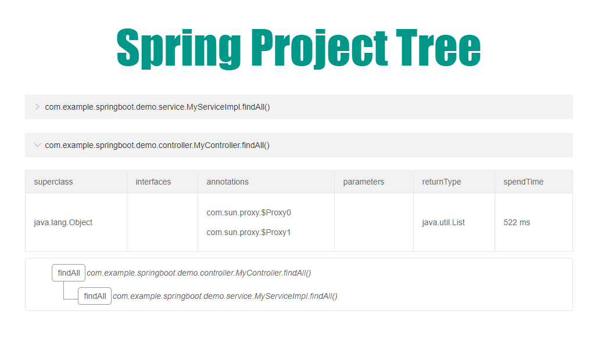

很多新人进入一家新公司后，最头疼的就是如何快速了解公司的业务和项目架构。

因为文档很少，没有文档，或者是文档严重落伍， 根本没法看；如果你碰到一个特别热心的老员工，事无巨细地给你讲，随时在你身边答疑解惑， 那简直是天大的好运气， 现实是大家都很忙，没人给你讲解。

很快就要深入项目做开发了，怎么办呢？

我在加入新公司后，就遇到了悲催的情况。于是，我就做了这款可视化流程分析插件！帮助更多入职新人快速熟悉业务。

演示网址：[http://116.85.23.6:8521/projecttree](http://116.85.23.6:8521/projecttree)

示范工程：https://gitee.com/zyzpp/Spring-Project-Tree-Demo

## 下载使用

项目暂时没有加入Maven中央仓库，所以还需要你clone或download到本地。

在本地计算机进入项目的pom.xml文件所在目录，打开命令行（CMD）,执行install命令安装到本地。

```
mvn install
```
*这里有一个小技巧，你可以手动修改pom.xml的spring-boot版本使它和你当前工程版本保持一致*

以后使用时，只需要导入依赖

```xml
<dependency>
    <groupId>cn.yueshutong</groupId>
    <artifactId>spring-project-tree</artifactId>
    <version>0.0.x-SNAPSHOT</version>
</dependency>
```

### Spring Boot安装

如果你的项目是Spring Boot，那么使用会非常简单，只需要一个注解即可。

@EnableProjectTree(value = "")注解参数为[pointcut](https://www.baidu.com/baidu?isource=infinity&iname=baidu&itype=web&tn=98012088_9_dg&ch=7&ie=utf-8&wd=%40pointcut%20%E8%A1%A8%E8%BE%BE%E5%BC%8F)表达式，完整代码如下：

```java
@SpringBootApplication
@EnableProjectTree("execution(* com.example.springboot.demo..*(..))")
public class SpringbootApplication {

    public static void main(String[] args) {
        SpringApplication.run(SpringbootApplication.class, args);
    }

}
```

注：重构后的Project Tree不止增加了对分布式接口的监控，还增加了pointcut表示式。

### 访问ProjectTree

启动你的项目，首先访问你项目的某个接口，使其执行被监控的方法。然后访问`localhost:8080/projecttree`查看网页。

#### 接口说明

| 接口                         | 说明                 |
| ---------------------------- | -------------------- |
| /projecttree                 | 返回完整调用链视图     |
| /projecttree/all             | 返回全部方法视图     |
| /json/projecttree            | JSON形式的返回结果   |
| /json/projecttree/{methodId} | 对某一方法的JSON结果 |

## 注意事项

使用Shiro、Spring Securit等安全框架时，需要注意对此URL的权限控制。

若你的项目使用Jpa并且遇到Dao层接口注入失败，Entity扫描失败，可以考虑使用@EntityScan和@EnableJpaRepositories注解。


## 源码亮点

1.如何降低对主流程的性能消耗？

使用多线程实现异步非阻塞模型。

2.为什么使用单例线程池？

只有一个线程的线程池实际是队列+单线程，一个一个的执行任务，完全符合本框架的使需求，多则出错。

3.为什么数据保存到内存？

基于内存的数据读写，基于方法调用链分析进行选择性保存，占用内存极小。理论上说，从接口开始，有多少流程分支，就有多少条数据记录。

4.如何实现方法调用分析？

基于栈数据结构设计算法。

5.如何解决多线程环境对算法的影响？

通过ThreadId加Stack自定义数据结构“线程栈”实现线程隔离。

## 关于作者

博客：[http://www.yueshutong.cn](http://www.yueshutong.cn)

邮箱：yster@foxmail.com

Github：[https://github.com/yueshutong/Spring-Project-Tree](https://github.com/yueshutong/Spring-Project-Tree)

Gitee：[https://gitee.com/zyzpp/Spring-Project-Tree](https://gitee.com/zyzpp/Spring-Project-Tree)

交流QQ群：781927207

